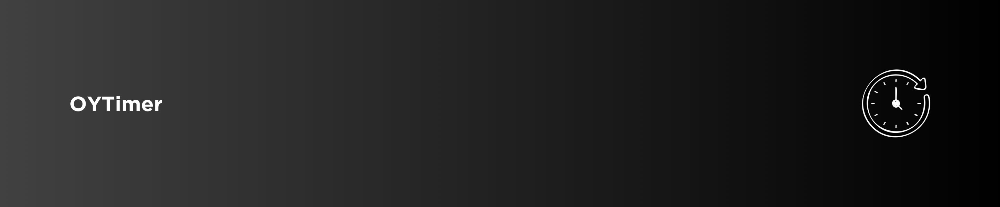

[](https://cocoapods.org/pods/OYTimer)
[](https://swift.org/package-manager/)
[](https://github.com/osmanyildirim/OYTimer)
[](https://swift.org)
[](https://developer.apple.com/xcode)
[](https://opensource.org/licenses/MIT)

<p align="left">
  
</p>

Swift SDK of [Timer](https://developer.apple.com/documentation/foundation/timer) with Countdown, Repeat and After types

## Contents

- [Requirements](#requirements)
- [Installation](#installation)
- [Usage](#usage)
    - [After](#after)
    - [Countdown](#countdown)
    - [Repeat](#repeat)
- [License](#license)

## Requirements

* iOS 11.0+
* Swift 5.0+

## Installation

<details>
<summary>CocoaPods</summary>
<br/>
<p>Add the following line to your <code>Podfile</code></p>

```
pod 'OYTimer'
```
</details>

<details>
<summary>Swift Package Manager</summary>
<br/>
<p>Add OYTimer as a dependency to your <code>Package.swift</code> and specify OYTimer as a target dependency</p>

```swift
import PackageDescription
  
let package = Package(
    name: "YOUR_PROJECT_NAME",
    targets: [],
    dependencies: [
        .package(url: "https://github.com/osmanyildirim/OYTimer", .upToNextMinor(from: "1.0")),
    ],
    targets: [
        .target(
            name: "YOUR_PROJECT_NAME",
            dependencies: ["OYTimer"])
    ]
)
```
</details>

## Usage

### After

```swift
let timer = OYTimer(type: .after(5.second_s), interval: 1.second_s)

timer.start { [weak self] state, _, _ in
    if case .completed = state {
        // do stuff
    }
}
```

### Countdown

> The timer will be invalidate when state is `.completed`

```swift
let timer = OYTimer(type: .countdown(1.minute_s), interval: 1.second_s)

timer.start { [weak self] state, _, remaining in
    if case .ticking = state {
        print(remaining)
    } else if case .completed = state {
        // do stuff
    }
}
```

### Repeat

```swift
let timer = OYTimer(type: .repeat, interval: 1.second_s)

timer.start { [weak self] state, counter, _ in
    if case .ticking = state {
        print(counter)
    }

    if counter == 20 {
        timer.stop()
    }
}
```

## License
OYTimer is released under an MIT license. [See LICENSE](https://github.com/osmanyildirim/OYTimer/blob/main/LICENSE) for details.